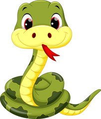

  

Python Tricks is a collections of script that help us to be al little bit more efective in Python.

### Dictionary
* [3 ways to init dictionaries](../master/dict_init.py)
* [How to merge dictionaries](../master/merge_dict.py)
* [How to sort a dictionary by a value](../master/sort_dictionary_by_value.py)
* [Deleting elements of a dictionary](../master/remove_elements_dict.py)

### List
* [How to merge lists](../master/merge_list.py)
* [Find most frequently element using Counter](../master/most_frequent.py)
* [Sum all elements of list](../master/sum_list_elements.py)
* [Find in a list of dictionaries](../master/find_list_dict.py)

### JSON
* [Writing a JSON file using open](../master/create_file_json.py)
* [Print a beautiful JSON](../master/print_beautiful_json.py)

### Datetime
* [Get init and end date of a week base on a date](../master/date_init_end_of_week.py)

### String
* [Slice a phrase by word instead of characters](../master/slice_phrase.py)

### Comparison
* [Slice a phrase by word instead of characters](../master/comparison_and.py)
